## Introduction

The IEC-61131-3 standard collects 5 programming languages to help you to create your programs; you can use them together to make an entire program, grouping them into functions and function blocks. In addition to the standard languages, an Arduino sketch can be integrated, interacting with the other languages by means of Shared Variables. This kind of development can be accomplished using Arduino PLC IDE. In this tutorial you will familiarize yourself with all of them while having an Arduino sketch in mind as a reference.

## Goals

The goals of this tutorial are:

- Get familiar with the PLC IDE environment functionalities
- Convert the reference sketch into programs with all of the IEC-61131-3 languages (LD, SFC, FBD, ST, IL)

### Required Hardware and Software

- [Portenta Machine Control](https://store.arduino.cc/products/arduino-portenta-machine-control)

## Common Features

### Variables Addition

There are 2 types of variables:
* Global variables: All of the 5 programs can access it.
* Local variables: Only one program has access to it.

#### Global Variable

Click inside the **Project** tab and click the **Global_vars** section, a table is available to see the full list of global variables on your project.

To add a new one, right-click on the table and click the **insert** button.
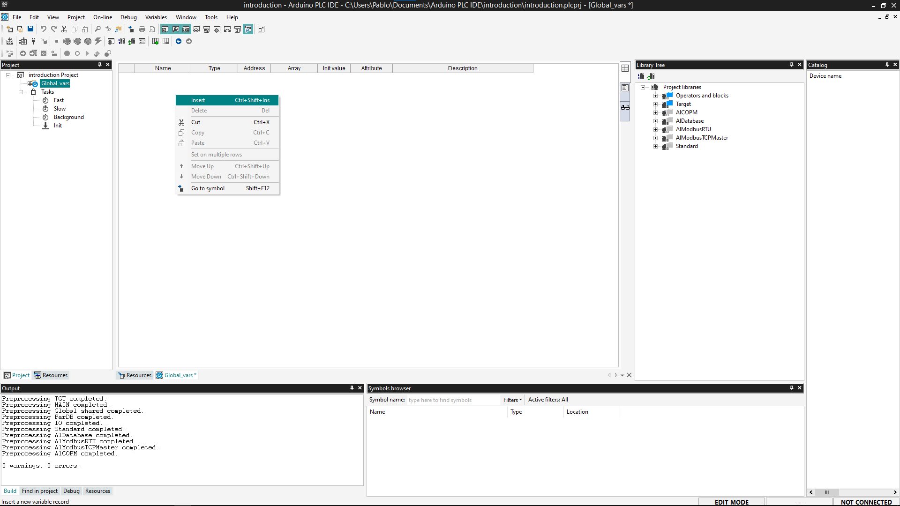

It will add a new row with the default settings, you can double-click each field and change them as you need.


After setting the new variable, you will be able to access it from all your language programs.

You will see a list with all the global variables in the **Global_vars** section.
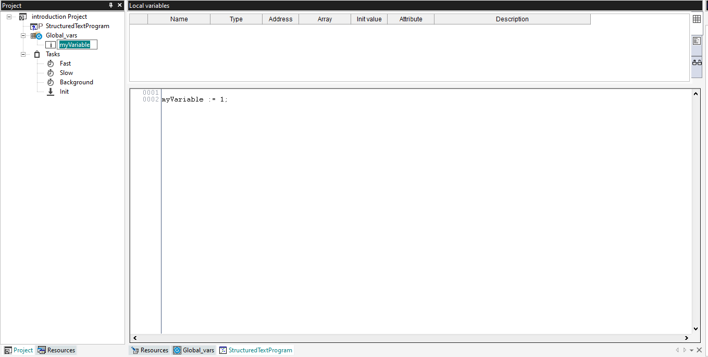

#### Local Variable

Go inside the **Project** tab and select a program by double-clicking it, once it has been opened you will see a **Local Variables** table on the top panel.
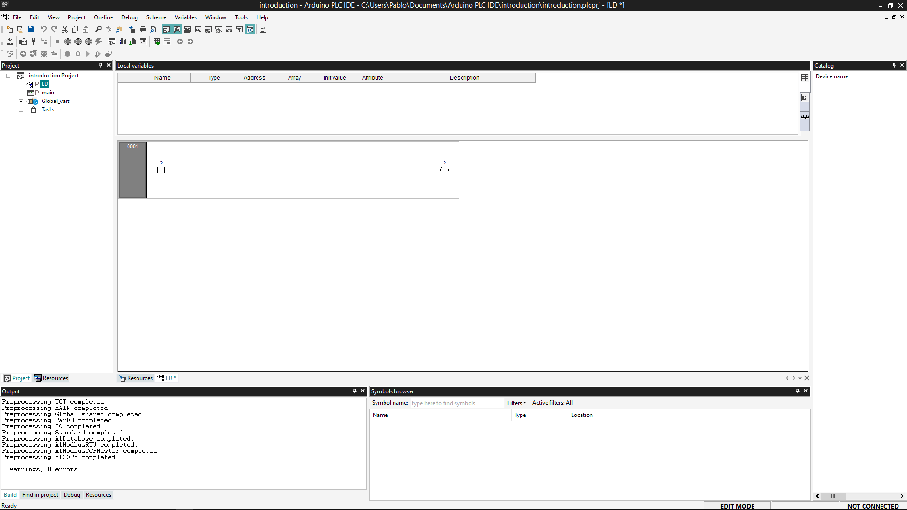

Following the same steps explained previously, you can right-click the table, and press the **insert** button.
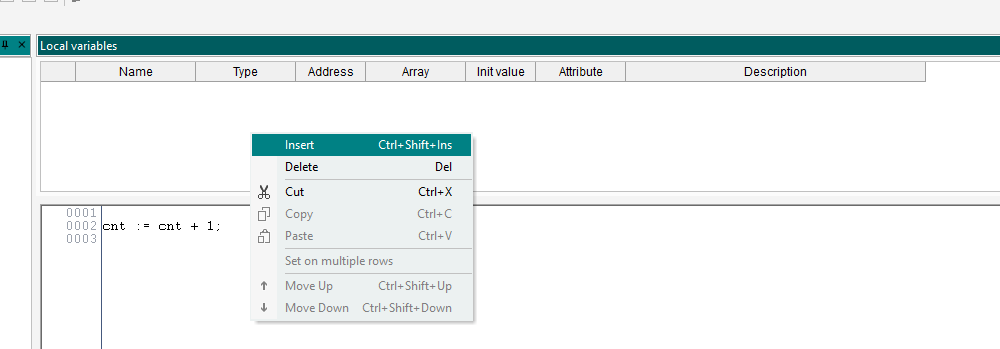

A new variable will be added with default settings, double-click each of them to change them as you need.

### Adding Blocks

The blocks are features or functions available from libraries and the PLC IDE.

These will help you to perform tasks, like AND gates, ADD function, etc...

To add a block to your program (only possible with LD, SFC, FBD) you can drag and drop them from the right side window called "Library Tree"
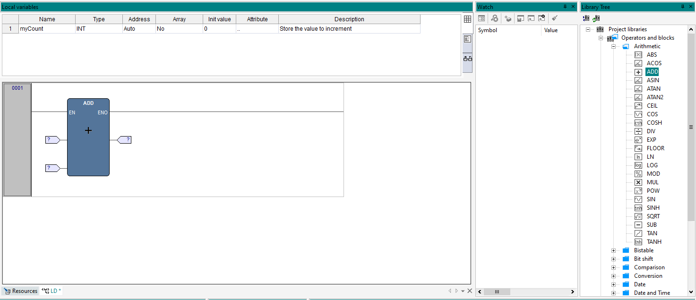

Once you drag and drop it on your canvas it will generate a block with some input and output pins fully customizable, most of the time you can right-click the block and add more pins in case you need more than the default.

### Task Attachment

Once you have your programs you can attach them to a task inside the runtime.

There are 4 Tasks:
* Init: Single execution of the assigned programs, done on the initialization
* Fast: Loop that executes the attached programs, every 10ms by default (it can be changed)
* Slow: Loop that executes the attached programs, every 100ms, can not be changed
* Background: Loop that executes the attached programs, every 500ms, can not be changed

To assign a program to a task, you can easily drag and drop your program to the task.
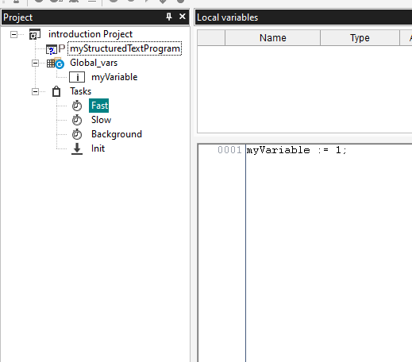

By default the `main` program is attached to the `Fast` task, you can remove it by right-clicking and pressing the "remove program" option.

You can also assign a new program by right-clicking the task and pressing `Add program`, then select the program from the list shown in the pop-up window.

If you want to configure the task, right-click on it and press `Task configuration`, you will be able to, for example, change the cycle time of the task.

***The execution order will be from top to bottom, the order shown inside each task.***

### Watch Variables

To check that our program is running and counting correctly, we will use the **watch** feature which allows you to see the value of a variable in real time.

To do so you need to go to **View > Tool windows > Watch** and you will have a new tool window.

Inside the **Tool window** you can drag and drop variables, or click the **Insert new item** button to add a specific variable.

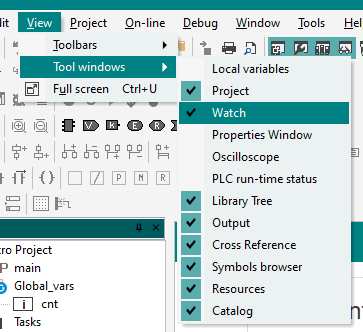

### Library Management

The PLC IDE manages the library add-on and usage differently from the traditional Arduino IDE. To add the desired library, go to **Resources** tab and click the **Libraries** listed under the **Sketch**.

With the 'Sketch Libraries' window open, click the **Add** option and fill out the library name. You will have to fill in the needed library version as well.

It is possible to find this information using the [Arduino Library List](https://www.arduinolibraries.info/) or by navigating manually to the local libraries directory and obtaining meta-data from 'library.properties' as a reference if you have the released library file locally.

For example, if you want to add the 1.1.1 version of the 'Arduino_MachineControl' library, respective information must be introduced to its fields accordingly.


Once you have followed the previous steps, the libraries will be available for use. A library of choice can be removed by clicking on the **Remove** option within the 'Sketch Libraries' window.

***Currently only publicly available libraries can be added to the PLC IDE Arduino Sketch, and you can check them by searching in the [Arduino Library List](https://www.arduinolibraries.info/).***

The following short clip shows how a library is added to the PLC IDE Arduino Sketch.

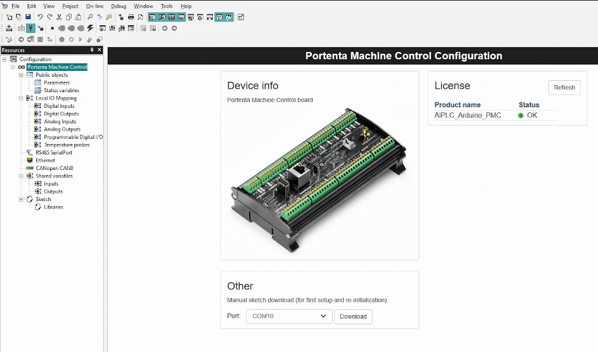

## Sample Program

The program will be a simple counter, increasing the count by X over time.

### Arduino Sketch

```cpp
int count = 0;
const int addition = 1;

void setup(){}
void loop(){
    count += addition;
}
```

### IEC-61131-3 Languages

To create a new program open your project tab, go to the toolbar **Project > New object > New program**, set a name for your program and select its language.

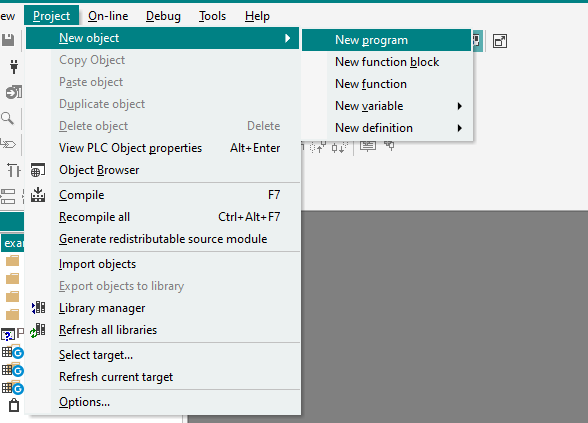

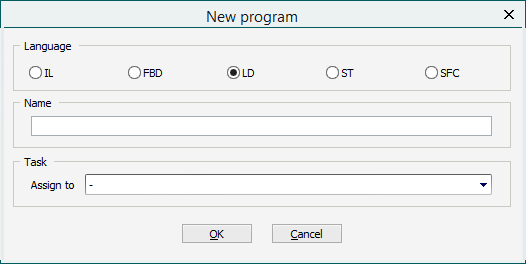

***Reminder: you can choose inside the project settings if you want to have case-sensitive programs, we set that to true. You can change that by going to `Project > Options... > Code generation` and click the `Case sensitive` checkbox***

There are 5 languages available:
* Structured Text (ST)
* Instruction List (IL)
* Ladder Diagram (LD)
* Sequential Function Chart (SFC)
* Function Block Diagram (FBD)

### Structured Text

This language is similar to C, the code to assign a value to a variable is the following:
```
count := count + addition;
```

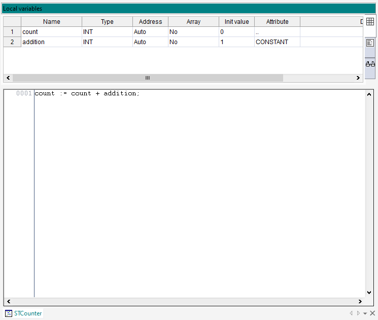

### Instruction List

This programming language is similar to Assembly programming.

The code for a counter script is:
```
LD count
ADD addition
ST count
```


### Ladder Diagram

This programming environment is based on lines and blocks, a line has a path from left to right that needs to pass all the in between blocks in order to continue towards the right, if it does pass all the different blocks (like AND gates) it will end on the right on a brackets symbol (coil) triggering whatever you have set up to do, which could be for example a relay latching to Normally-Open (NO).

This is how a counter program looks:
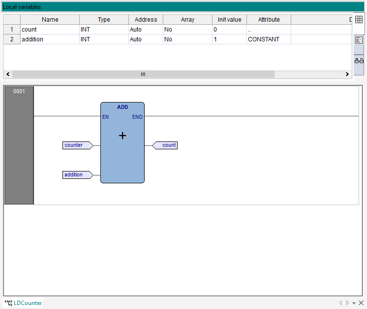

Here is a video doing that from scratch:
<iframe width="100%" height="415" src="https://www.youtube.com/embed/0EdATSgIc9o" title="YouTube video player" frameborder="0" allow="accelerometer; clipboard-write; encrypted-media; gyroscope; picture-in-picture" allowfullscreen></iframe>

### Sequential Function Chart

This language approaches the script in a similar way as a flowchart, meaning you have blocks that do some work, you check the result of that work, and afterward you keep flowing with the choices.

SFC language can not interact directly with the machine, meaning you can not make an output be OFF directly, to do so you will need to create **actions**

#### Actions

An action is a script in another language (i.e. structured text) that performs the work, this will get triggered depending on the chart.

To create one go to your project tree, right-click the SFC script and click the "New action" button.

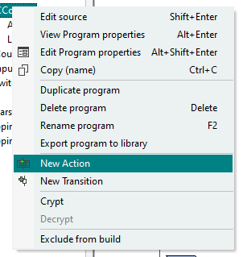

#### SFC Program

You have blocks available by right-clicking inside the canvas or on the top bar, you can drag and drop them.

The SFC program has one rule which is following the order of **Step<sub>0</sub> > Transition<sub>0</sub> > Step<sub>n</sub> > Transition<sub>n</sub> > ... > Jump**

A **Step** is the job to do, and a **Transition** is the result of that work.

A **Jump** is a link to another **Step** of the chart. In order to make a loop you will need to use the jump to point the "init" step.

The counter program should look like the following picture. Note the action inside the "count" Step: you can see a small "counter" text which is the action's name of the program done in Structured Text which code is the same as shown in the Structured Text section.
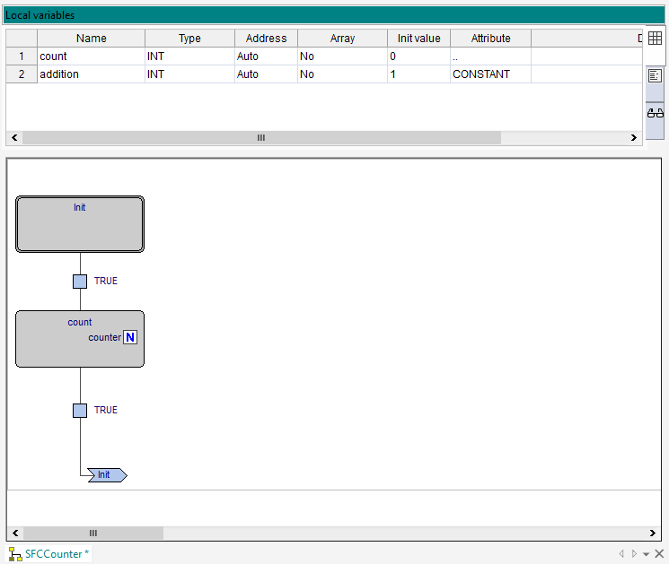

Here is a video doing that from scratch:
<iframe width="100%" height="415" src="https://www.youtube.com/embed/olQooS4bX4A" title="YouTube video player" frameborder="0" allow="accelerometer; clipboard-write; encrypted-media; gyroscope; picture-in-picture" allowfullscreen></iframe>

### Functional Block Diagram

This is similar to the SFC Programming, but in this case there is no sequential path on the program, you add blocks to do the needed work.

For example, adding the **Add** block will do the Add function each cycle.

This is how the counter program looks:
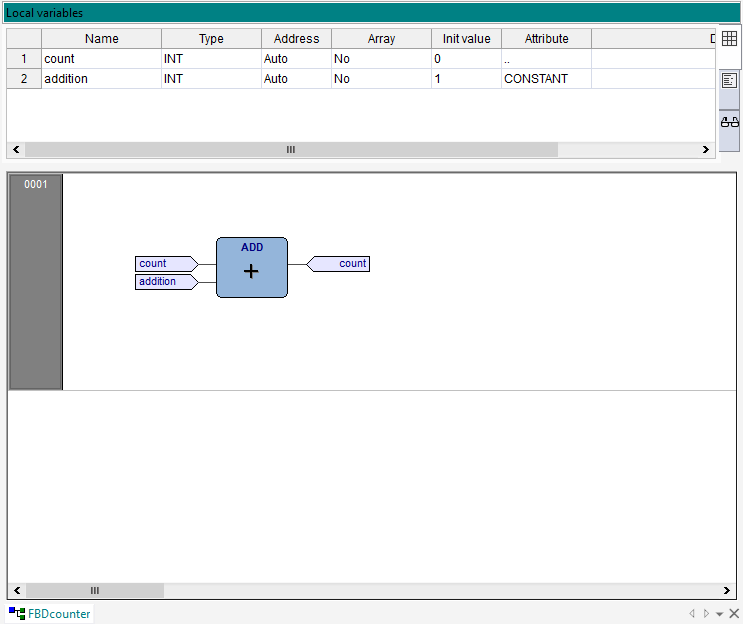

Here is a video doing that from scratch:
<iframe width="100%" height="415" src="https://www.youtube.com/embed/l1L4jzDVKyE" title="YouTube video player" frameborder="0" allow="accelerometer; clipboard-write; encrypted-media; gyroscope; picture-in-picture" allowfullscreen></iframe>

***In the previous programs, we used local variables, remember to select the program's specific variables to be watched, or you will not see any data***

## Conclusion

You have:
* Created a simple counter with each language
* Learned how to watch live variable's value
* Attached a program to a task
* Used blocks

Now we suggest that you use this basic knowledge and make more advanced programs to get familiar with each one, feel free to try different blocks, inspect the code of those and navigate through the different panels.