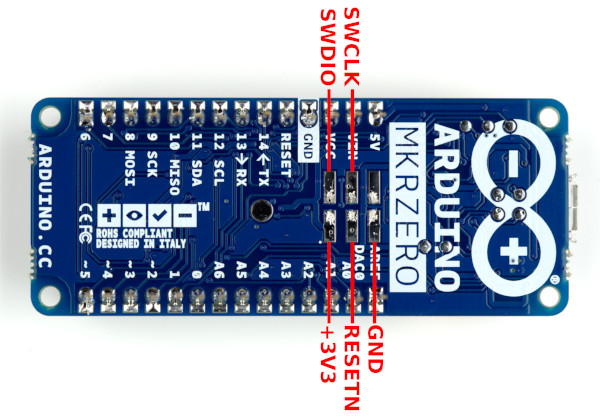

In this tutorial, we will learn how to burn the bootloader on non-AVR boards using another Arduino board. The bootloader is a small piece of software that allows uploading sketches onto the Arduino board. It comes preprogrammed on the microcontrollers on Arduino boards. Whether the bootloader has been corrupted or intentionally has been removed, it can be restored by burning (also called, flashing or programming) a new bootloader to the board.

>**Note:** If you want to burn the bootloader on AVR boards such as an UNO, Mega, and classic Nano you can check out [these instructions](https://support.arduino.cc/hc/en-us/articles/4841602539164-Burn-the-bootloader-on-UNO-Mega-and-classic-Nano-using-another-Arduino).

## You will need:
- An extra Arduino board that runs at 3.3V to use as the programmer.

>**Note:** Certain Arduino boards can't be used with the sketch that converts it to a programmer. It is possible to use an Arduino board that runs at 5V as the programmer, but you will need to use level shifting circuitry on the programming lines to avoid exposing the target board to 5V logic levels, which would damage it.

| Working  | Untested      | Not working      |
| ----------- | ----------- |----------- |
| SAMD architecture boards         | AVR architecture boards        |Nano 33 BLE        |

- An SD slot. This could be built into your Arduino board (e.g., [MKR Zero](https://store.arduino.cc/products/arduino-mkr-zero-i2s-bus-sd-for-sound-music-digital-audio-data?_gl=1%2A17dcyg9%2A_ga%2AMjEyMzQ2MjgwOC4xNjY1NjUyNTY3%2A_ga_NEXN8H46L5%2AMTY3MTYyNzMzMS4xNjEuMS4xNjcxNjI5ODA2LjAuMC4w)), a shield (e.g., [MKR SD Proto Shield](https://store.arduino.cc/products/mkr-sd-proto-shield?_gl=1%2A1xs1eol%2A_ga%2AMjEyMzQ2MjgwOC4xNjY1NjUyNTY3%2A_ga_NEXN8H46L5%2AMTY3MTYyNzMzMS4xNjEuMS4xNjcxNjMwMzgxLjAuMC4w)), or one of the common SD modules.
- An SD card that fits your SD slot.
- A way to connect the SD card to your computer.
- A way to make the connections to the SWD pins on your target Arduino board. 

For the [Nano 33 IoT](https://store.arduino.cc/products/arduino-nano-33-iot?_gl=1%2A80ta1j%2A_ga%2AMjEyMzQ2MjgwOC4xNjY1NjUyNTY3%2A_ga_NEXN8H46L5%2AMTY3MTYyNzMzMS4xNjEuMS4xNjcxNjMwNDIwLjAuMC4w) and the MKR Boards other than MKR1000, we found it the easiest to use a 0.1" pitch 2x3 POGO adapter. You could also solder wires to the test points if you prefer. On the MKR boards other than the MKR1000, the SWD header is on the bottom of the board and is the footprint for a 0.1" pitch 2x3 SMD header. On the MKR1000, it is a 0.05" pitch 2x5 male header on the top of the board, which you will need an adapter and one cable for.

## Instructions
- Connect an SD card to your computer.
- Open this link in your browser: https://github.com/arduino/ArduinoCore-samd/tree/master/bootloaders
- Click the folder that matches the name of your target board.
- Click the file that ends in ```.bin```
- Click the **Download** button
- Rename the downloaded file to ```fw.bin```
- Move ```fw.bin``` to the SD card.
- Eject the SD card from your computer.
- Plug the USB cable of the Arduino board you will be using as a programmer into your computer.
- Select **Sketch > Include Library > Manage Libraries...** from the Arduino IDE's menus.
- Wait for the download to finish.
- In the **"Filter your search..."** field, type "Adafruit DAP library".
- Press **Enter**.
- Click on **"Adafruit DAP library by Adafruit"**.
- Click the **"Install"** button.
- Wait for the installation to finish.
- Click the **Close** button.
- Select **File > Examples > Adafruit DAP library > samd21 > flash_from_SD** from the Arduino IDE's menus.
- Change this line: ```#define SD_CS 4``` 

    according to the Arduino pin connected to the SD CS pin. If your board has a built-in SD slot (e.g., [MKR Zero 9](https://store.arduino.cc/products/arduino-mkr-zero-i2s-bus-sd-for-sound-music-digital-audio-data)), then you can change this line:

    ```
    (!SD.begin(SD_CS)) { 
    ```

    to:

    ```
    if (!SD.begin()) {
    ```

- Select the correct board from the **Tools > Board** from the Arduino IDE's menus.
- Select the correct port from the **Tools > Port** from the Arduino IDE's menus.
- Select **Sketch > Upload** from the Arduino IDE's menus.
- Wait for the upload to finish successfully.
- Unplug the programmer Arduino board from your computer.
- Plug the SD card into the SD slot connected to your Arduino board.
- Connect the programmer Arduino board to the target Arduino board as follows:

    | Programmer  | Target      |
    | ----------- | ----------- |
    | VCC         | +3V3        |
    | 10          | SWDIO       |
    | 9           | SWCLK       |
    | GND         | GND         |
    | 11          | RESETN      |

    SWD pads on MKR boards other than MKR 1000:

    

    MKR1000 SWD header pinout:

    

    Nano 33 IoT SWD pads:

    

- Plug the USB cable of the programmer Arduino board into your computer.
- Select **Tools > Serial Monitor** from the Arduino IDE's menus. You should now see the Serial Monitor output showing the target board detected, and the bootloader file flashed to it successfully.
- Unplug the programmer Arduino board from your computer.
- Disconnect the programmer Arduino board from the target Arduino board.

## Alternatives
These are some alternatives to the "Adafruit DAP" method described above.

**Using a CMSIS-DAP debug probe as the programmer**
If you have a CMSIS-DAP compliant debug probe, you can just do this instead:

- Connect the debug probe to your Arduino board.
- Select **Tools > Programmer > Atmel EDBG** from the Arduino IDE's menus.
- Select **Tools > Burn Bootloader** from the Arduino IDE's menus. - The "Burn Bootloader" process should now finish successfully.

You can use [this little open-source debugger](https://www.tindie.com/products/ataradov/cmsis-dap-compliant-swd-debugger/)

**Using a J-Link as the programmer**
Segger J-Link debug probes (e.g., J-Link EDU Mini) can be used with the Adalink software:
https://github.com/adafruit/Adafruit_Adalink

This is a fairly complex procedure, so we recommend against this option unless you already own a J-Link and don't have the supplies on hand for one of the other options.