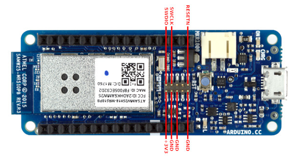

In this tutorial, we will learn how to burn the bootloader on boards that use the ATSAMD21G18 microcontroller using another Arduino board. The bootloader is a small piece of software that allows uploading sketches onto the Arduino board. It comes preprogrammed on the microcontrollers on Arduino boards. Whether the bootloader has been corrupted or intentionally has been removed, it can be restored by burning (also called, flashing or programming) a new bootloader to the board.

>**Note:** If you want to burn the bootloader on AVR boards such as an UNO, Mega, and classic Nano you can check out [these instructions](https://support.arduino.cc/hc/en-us/articles/4841602539164-Burn-the-bootloader-on-UNO-Mega-and-classic-Nano-using-another-Arduino).

## Requirements
- An extra SAMD-based Arduino board to use as the programmer.
- An SD slot. This could be built into your Arduino board (e.g., [MKR Zero](https://store.arduino.cc/products/arduino-mkr-zero-i2s-bus-sd-for-sound-music-digital-audio-data?_gl=1%2A17dcyg9%2A_ga%2AMjEyMzQ2MjgwOC4xNjY1NjUyNTY3%2A_ga_NEXN8H46L5%2AMTY3MTYyNzMzMS4xNjEuMS4xNjcxNjI5ODA2LjAuMC4w)), a shield (e.g., [MKR SD Proto Shield](https://store.arduino.cc/products/mkr-sd-proto-shield?_gl=1%2A1xs1eol%2A_ga%2AMjEyMzQ2MjgwOC4xNjY1NjUyNTY3%2A_ga_NEXN8H46L5%2AMTY3MTYyNzMzMS4xNjEuMS4xNjcxNjMwMzgxLjAuMC4w)), or one of the common SD modules.
- An SD card that fits your SD slot.
- A way to connect the SD card to your computer.
- A way to make the connections to the SWD pins on your target Arduino board.

## Instructions
- Select **Sketch > Include Library > Manage Libraries...** from the Arduino IDE menus.
- Wait for any index updates to finish.
- In the **"Filter your search..."** field, type `Adafruit DAP library`
- Press **Enter**.
- Click on "**Adafruit DAP library by Adafruit**".
- Click the **Install** button.
- Wait for the installation to finish.
- Close **Library Manager**.
- Select **File > Examples > Adafruit DAP library > samd21 > flash_MKR_bootloaders** from the Arduino IDE menus. 
    - despite the "MKR" in the sketch name, this also supports the [**Nano 33 IoT**](https://store.arduino.cc/products/arduino-nano-33-iot)
- Select your **programmer** Arduino board from Arduino IDE's **Tools > Board** menu.
- Select the port of the **programmer** Arduino board from Arduino IDE's **Tools > Port** menu.
- Select **Sketch > Upload** from the Arduino IDE menus.
- Wait for the upload to finish successfully.
- Unplug the **programmer** Arduino board from your computer.
- Connect the **programmer** Arduino board to the **target** Arduino board as follows:
   | Programmer | Target |
   | ---------- | ------ |
   | VCC        | +3V3   |
   | 1          | SWDIO  |
   | 2          | SWCLK  |
   | GND        | GND    |
   | 0          | RESETN |

**SWD pads on MKR boards other than MKR 1000:**


 **MKR 1000 SWD header pinout:**


**Nano 33 IoT SWD pads:*


- Plug the USB cable of the **programmer** Arduino board into your computer.
- Select **Tools > Serial Monitor** from the Arduino IDE menus.
- Select "No line ending" from the dropdown menu near the bottom right corner of the **Serial Monitor** window.

You should see some instructions for using the sketch in the **Serial Monitor** output field.
   This includes a menu of the boards supported by the sketch:
   ```text
   [...]

   Select Arduino MKR board to erase and flash with bootloader:
   
   Z     -> Arduino Zero (6504 bytes)
   MZ    -> Arduino MKR Zero (6408 bytes)
   1000  -> Arduino MKR 1000 WIFI (6408 bytes)
   1010  -> Arduino MKR WIFI 1010 (7984 bytes)

   [...]
   ```
   Find your **target** Arduino board on the list and note the code written to the left of it.

- Type the code for the **target** Arduino board in the message field of **Serial Monitor**.
- Press the **Enter** key.
- The Serial Monitor output field should now show the board you selected and the progress of flashing the bootloader to the **target** Arduino board.
   Wait for it to show "Done!"
- Unplug the **programmer** Arduino board from your computer.
- Disconnect the **programmer** Arduino board from the **target** Arduino board.