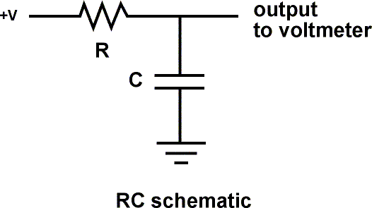
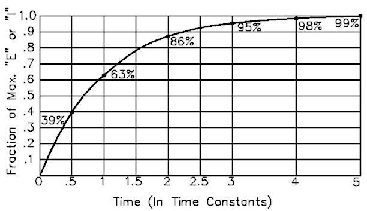
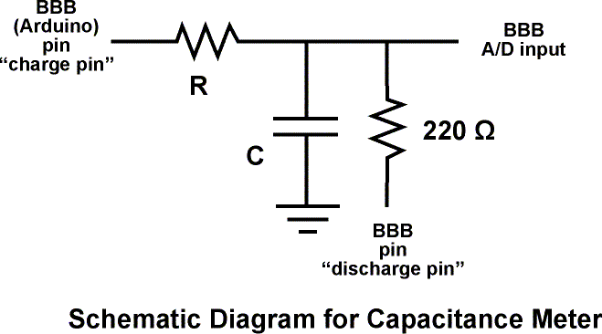

**Overview:** A resistor will charge a capacitor in TC seconds, where:

- TC = R * C

- TC = time constant in seconds

- R = resistance in ohms

- C = capacitance in farads (1 microfarad [ufd] = .000001 farad = 10^-6 farads )

The voltage at 1 Time Constant equals 63.2% of the charging voltage.

- Example: 1 megohm * 1 microfarad = 1 second
- Example: 10k ohms  * 100 microfarad = 1 second



## Experimental Setup

This sketch works because the Arduino pins can be in one of two states, which are electrically very different.

- Input State (set with pinMode(pin, INPUT);)

- High Impedance (resistance) - Makes very little demand on the circuit that it is sampling

- Good for reading sensors but not lighting LED's

- Output State (set with pinMode(pin, OUTPUT);)

- Low Impedance - Can provide 40 mA source (positive voltage), or sink (negative voltage)

- Good for lighting LED's, driving other circuits - useless for reading sensors.

Additionally the pins can be HIGH (+5 volts), to charge the capacitor; or LOW (ground) to discharge the capacitor



## Algorithm for capacitance meter sketch

- Set discharge pin to INPUT (so it can't discharge the capacitor)

- Record the start time with millis()

- Set charge pin to OUTPUT and make it HIGH

- Check the voltage repeatedly in a loop until it gets to 63.2% of total voltage.

- After the cap is charged, subtract the current time from the start time to find out how long the capacitor took to charge.

- Divide the Time in seconds by the charging Resistance in ohms to find the Capacitance.

- Report the value with serial.print

- Discharge the capacitor. To do this:

- Set the charge pin to Input

- Set the discharge pin to OUTPUT and make it LOW

- Read the voltage to make sure the capacitor is fully discharged

- Loop and do it again

## Arduino Sketch

```arduino
/*  RCTiming_capacitance_meter

 *   Paul Badger 2008

 *  Demonstrates use of RC time constants to measure the value of a capacitor

 *

 * Theory   A capcitor will charge, through a resistor, in one time constant, defined as T seconds where

 *    TC = R * C

 *

 *    TC = time constant period in seconds

 *    R = resistance in ohms

 *    C = capacitance in farads (1 microfarad (ufd) = .000001 farad = 10^-6 farads )

 *

 *    The capacitor's voltage at one time constant is defined as 63.2% of the charging voltage.

 *

 *  Hardware setup:

 *  Test Capacitor between common point and ground (positive side of an electrolytic capacitor  to common)

 *  Test Resistor between chargePin and common point

 *  220 ohm resistor between dischargePin and common point

 *  Wire between common point and analogPin (A/D input)

 */

#define analogPin      0          // analog pin for measuring capacitor voltage
#define chargePin      13         // pin to charge the capacitor - connected to one end of the charging resistor
#define dischargePin   11         // pin to discharge the capacitor
#define resistorValue  10000.0F   // change this to whatever resistor value you are using

                                  // F formatter tells compliler it's a floating point value

unsigned long startTime;
unsigned long elapsedTime;
float microFarads;                // floating point variable to preserve precision, make calculations
float nanoFarads;

void setup(){

  pinMode(chargePin, OUTPUT);     // set chargePin to output

  digitalWrite(chargePin, LOW);

  Serial.begin(9600);             // initialize serial transmission for debugging
}

void loop(){

  digitalWrite(chargePin, HIGH);  // set chargePin HIGH and capacitor charging

  startTime = millis();

  while(analogRead(analogPin) < 648){       // 647 is 63.2% of 1023, which corresponds to full-scale voltage

  }

  elapsedTime= millis() - startTime;

 // convert milliseconds to seconds ( 10^-3 ) and Farads to microFarads ( 10^6 ),  net 10^3 (1000)

  microFarads = ((float)elapsedTime / resistorValue) * 1000;

  Serial.print(elapsedTime);       // print the value to serial port

  Serial.print(" mS    ");         // print units and carriage return

  if (microFarads > 1){

    Serial.print((long)microFarads);       // print the value to serial port

    Serial.println(" microFarads");         // print units and carriage return

  }

  else

  {

    // if value is smaller than one microFarad, convert to nanoFarads (10^-9 Farad).

    // This is  a workaround because Serial.print will not print floats

    nanoFarads = microFarads * 1000.0;      // multiply by 1000 to convert to nanoFarads (10^-9 Farads)

    Serial.print((long)nanoFarads);         // print the value to serial port

    Serial.println(" nanoFarads");          // print units and carriage return

  }

  /* dicharge the capacitor  */

  digitalWrite(chargePin, LOW);             // set charge pin to  LOW

  pinMode(dischargePin, OUTPUT);            // set discharge pin to output

  digitalWrite(dischargePin, LOW);          // set discharge pin LOW

  while(analogRead(analogPin) > 0){         // wait until capacitor is completely discharged

  }

  pinMode(dischargePin, INPUT);            // set discharge pin back to input
}
```

### Further things to try

- Substitute in larger resistors if the charging time is too short, smaller resistors if the charging time is too long.

- Measure capacitors in parallel and in series, check to see if your observations agree with electronic theory

- Average together a group of readings for more accuracy

- Swap out several charging resistors on different pins to make an "auto-ranging" capacitance meter

- Modify the sketch to have the charging resistor also discharge the capacitor. Note that the reported value is not twice the value reported when it only charges this capacitor. Explain this. Hint - study the changing curve on the graph.
