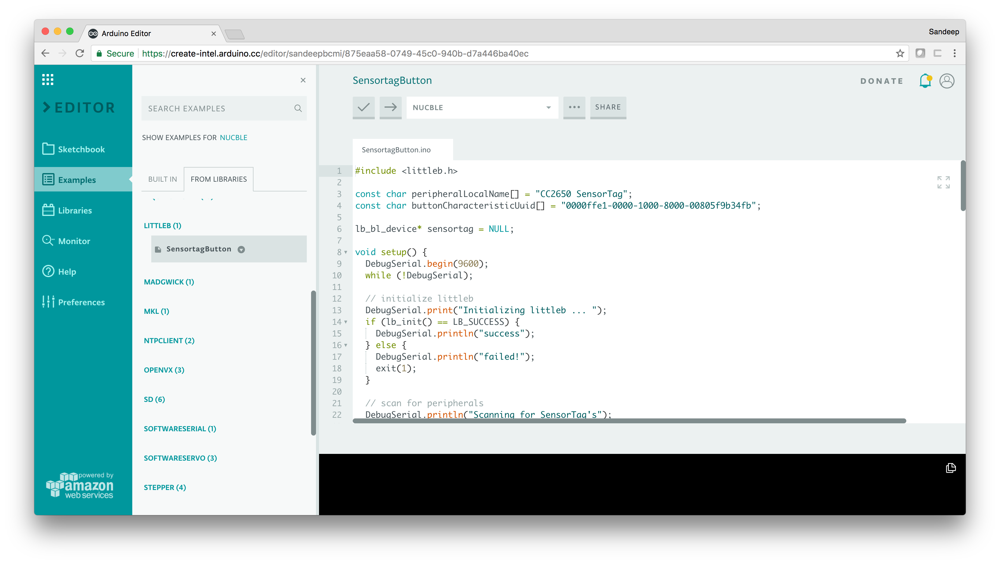
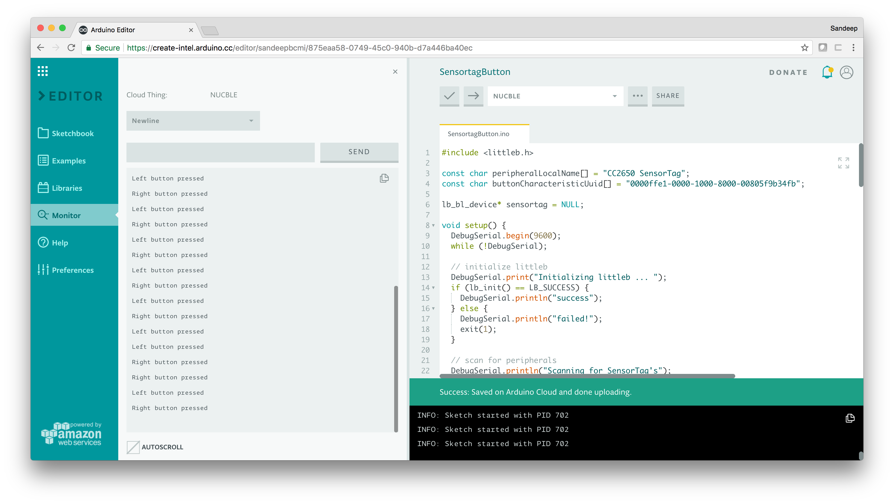

## Components and Supplies

- [Intel NUC](https://www.intel.com/content/www/us/en/products/boards-kits/nuc.html)
- [Texas Instruments CC2650STK SensorTag Kit](https://www.newark.com/41Y0857?COM=ref_hackster)
- Monitor with HDMI input
- HDMI cable
- USB Keyboard
- Bluetooth® 4.0 USB Adapter

## Apps and Online Services

- [Arduino Web Editor](https://create.arduino.cc/editor)

## About This Project

### Overview

In this tutorial, we'll learn how to setup an Intel NUC to interact with a TI SensorTag using Bluetooth® Low Energy. The [littleb](https://github.com/intel-iot-devkit/littleb) library will be used for Bluetooth® communications.

## Setup

- Follow [the Arduino Create getting started flow for the Intel NUC](https://create.arduino.cc/projecthub/Arduino_Genuino/getting-started-with-intel-iot-gateways-on-arduino-create-dcf1bc) and select the Ubuntu Linux option. **NOTE**: make sure the select "`Ubuntu`" on the "`Get a customized OS for your Gateway`" step!
- Once the NUC has been setup and rebooted, connect the Bluetooth® 4.0 USB adapter to the NUC.
- Open a terminal session, by pressing `CTRL+ALT+F1`on the keyboard attached to the NUC.
- Login using the credentials you set up previously.
- By default, the Ubuntu install does not include the required Bluetooth® software, it can be installed by running the following command:

```arduino
sudo apt-get update && sudo apt-get install bluez
```

- The `littleb`library requires you to enable `bluetoothd`experimental support. This can be done by editing the `/etc/systemd/system/bluetooth.target.wants/bluetooth.service`file on your NUC. Change the:

```arduino
ExecStart=/usr/lib/bluetooth/bluetoothd
```

line to:

```arduino
ExecStart=/usr/lib/bluetooth/bluetoothd -E
```

(add ` -E`).

- Once this change is complete, reboot the NUC:

```arduino
sudo reboot
```

## Loading the Sketch

Now that the NUC has been configured with the necessary requirements for the `littleb`library, we can load the sketch using Arduino Create.

Inside Arduino Create, open the Arduino Web Editor and select your Intel NUC device from the drop down. Then click the `Examples`menu item, followed by `From Libraries`, and then select the `SensortagButton `example from the `littleb`library.



Next, click the `Monitor`menu item on the left hide side. This will allow you to monitor the output of `DebugSerial`entries that are inside the sketch.

Once the monitor section is open, click the Upload (`->`) button to build and upload the sketch to your Intel NUC. After, sketch has been uploaded to the Intel NUC, press the button on the left on the TI SensorTag to make it advertise. When advertising, a green LED will start to blink.

The `SensortagButton`sketch, scans for SensorTag's continuously in 15 second intervals. Once a SensorTag is discovered it will try to connect to it, discover it's services and subscribe to the button characteristic (`0000ffe1-0000-1000-8000-00805f9b34fb`) for notifications. 


Now you can press the left or right button on the SensorTag, and it will send a notification Intel NUC. The `SensortagButton`sketch processes the notification and prints out the button that has been pressed (if any).



## Complete Sketch

<iframe src='https://create.arduino.cc/editor/Arduino_Genuino/1edcf727-6bad-4348-b954-35161a57d820/preview?embed&snippet' style='height:510px;width:100%;margin:10px 0' frameborder='0'></iframe>

## Next Steps

This tutorial has walked you through how to setup your NUC and use the `littleb`library to interact with a TI SensorTag over Bluetooth® Low Energy. The button characteristic was monitored and events were printed to the Arduino Create monitor area.

The TI SensorTag [exposes many other features over Bluetooth® Low Energy](http://processors.wiki.ti.com/index.php/CC2650_SensorTag_Users_Guide#Gatt_Server), you can use the example `SensortagButton`sketch as a starting point to interact with them.

