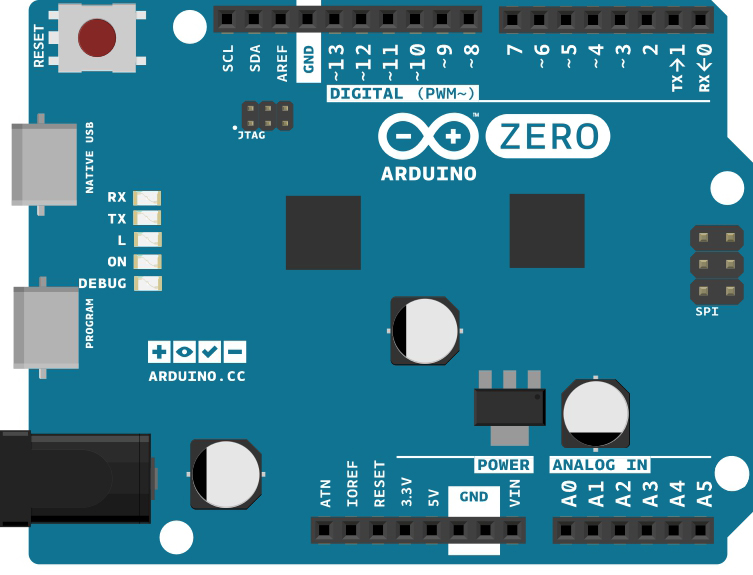

## Hardware Required

- [Arduino Zero](https://www.arduino.cc/en/Main/ArduinoBoardZero) or [MKRZero](https://www.arduino.cc/en/Main/ArduinoBoardMKRZero) or  [MKR1000](https://www.arduino.cc/en/Main/ArduinoMKR1000)

## Circuit

Only your Arduino Board is needed for this example.




## Code

```arduino

/*

  Sleep RTC Alarm for Arduino Zero

  Demonstrates the use an alarm to wake up an Arduino zero from Standby mode

  This example code is in the public domain

  http://arduino.cchttps://www.arduino.cc/en/Tutorial/SleepRTCAlarm

  created by Arturo Guadalupi

  17 Nov 2015

  modified

  01 Mar 2016


  NOTE:

  If you use this sketch with a MKR1000 you will see no output on the serial monitor.

  This happens because the USB clock is stopped so it the USB connection is stopped too.

  **To see again the USB port you have to double tap on the reset button!**

*/

#include <RTCZero.h>

/* Create an rtc object */

RTCZero rtc;

/* Change these values to set the current initial time */

const byte seconds = 0;

const byte minutes = 00;

const byte hours = 17;

/* Change these values to set the current initial date */

const byte day = 17;

const byte month = 11;

const byte year = 15;

void setup()
{

  pinMode(LED_BUILTIN, OUTPUT);

  digitalWrite(LED_BUILTIN, LOW);

  rtc.begin();

  rtc.setTime(hours, minutes, seconds);

  rtc.setDate(day, month, year);

  rtc.setAlarmTime(17, 00, 10);

  rtc.enableAlarm(rtc.MATCH_HHMMSS);

  rtc.attachInterrupt(alarmMatch);

  rtc.standbyMode();
}

void loop()
{

  rtc.standbyMode();    // Sleep until next alarm match
}

void alarmMatch()
{

  digitalWrite(LED_BUILTIN, HIGH);
}
```