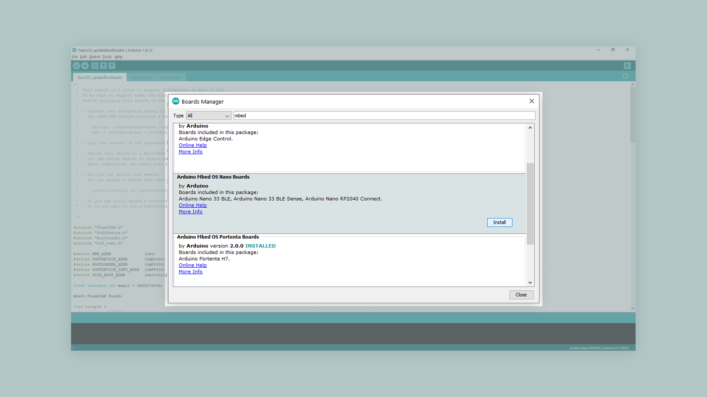
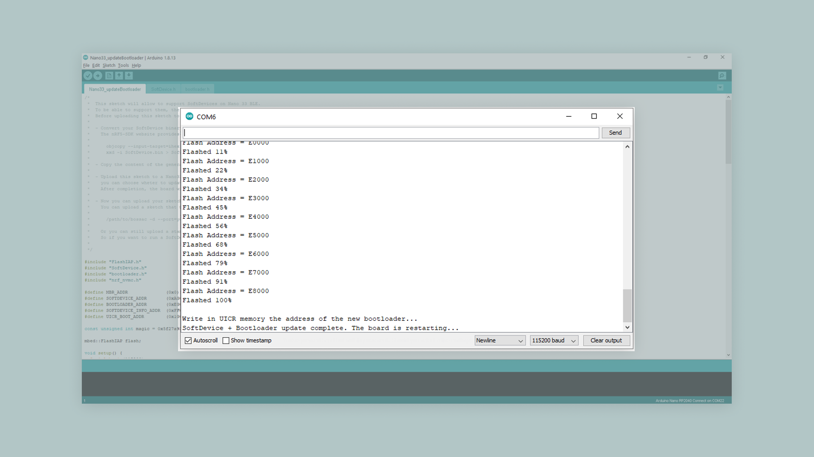
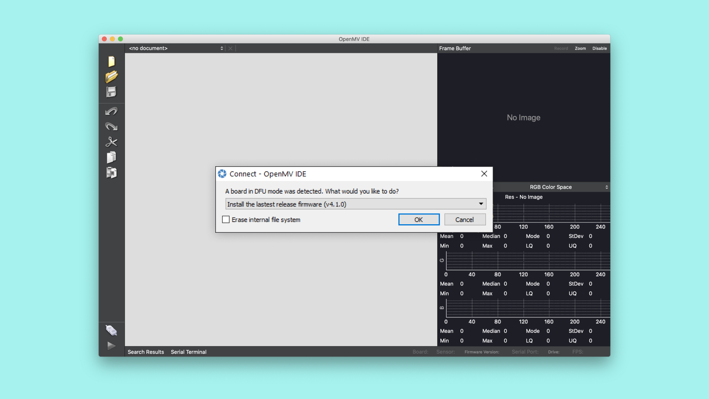
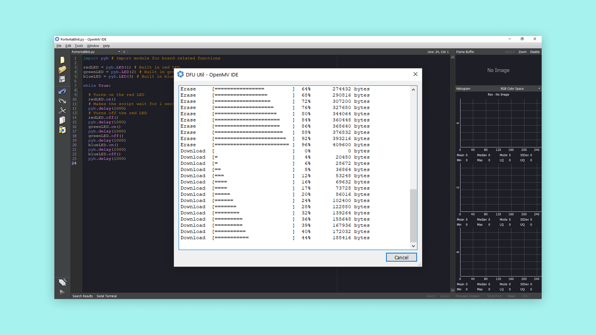

This tutorial will show you how to update the bootloader with an Arduino IDE sketch. This is required to run the OpenMV firmware. It shows you how to connect the board in OpenMV and upload a MicroPython script that controls the built-in RGB LED.

### Hardware & Software
- Nano 33 BLE or Nano 33 BLE sense
- Arduino IDE 1.8.10+ or Arduino Pro IDE 0.0.4+ 
- OpenMV IDE 2.6.4+

### How the New Bootloader Works

The updated bootloader will first look for a valid sketch at the memory address `0x10000`. This ensures backwards compatibility with the standard sketches uploaded from the Arduino IDE. If no valid sketch is found, because maybe a softdevice has been placed in that portion of the flash, the bootloader looks for a valid firmware at `0x26000` and this is the one that you will upload as part of this tutorial.


### Updating the Bootloader

With your board connected, open up the Arduino IDE. This step is the same for both the IDE 1 and the IDE 2. Open the board manager and search for **"mbed"**. Find the "Arduino Mbed OS Nano Boards" core and click on **"Install"** to install the latest version.



Then, open: **File>Examples>Nano33_System>Nano33_updateBLandSoftDevice**


Upload the sketch to your board and open the serial monitor. If you haven't installed the latest bootloader yet, in the serial monitor you will get the option to do so. Enter "y" into the serial monitor and press the return key. Once the process is done, you will be asked if you want to install the softdevice. Enter "y" and press the return key. Wait for the update to finish. Your board will restart when the process is done and put itself into bootloader mode.



### Downloading the OpenMV IDE

Before you can start programming OpenMV scripts for the Nano 33 BLE sense you need to download and install the OpenMV IDE.

Open the [OpenMV download](https://openmv.io/pages/download) page in your browser, download the version that you need for your operating system and follow the instructions of the installer.

### Flashing the OpenMV Firmware

Connect the Nano 33 BLE sense to your computer via the USB cable if you haven't done so yet. Make sure you have installed the latest bootloader and softdevice as indicated in the previous step.

After updating the bootloader put the Nano 33 BLE sense in bootloader mode if necessary. The board automatically goes into booloader mode after the update is finished. However, if you restarted the board in the mean time, double click the reset button to bring it into bootloader mode.


Click on the "connect" symbol at the bottom of the left toolbar. 


A pop-up will ask you how you would like to proceed "DFU bootloader(s) found. What would you like to do?". Select "Reset Firmware to Release Version". This will install the latest OpenMV firmware on the Nano. If it asks you whether it should erase the internal file system you can click "No".



A terminal window will open which shows you the upload progress. You will see a message saying "DFU firmware update complete!" when the process is done.



***Installing the OpenMV firmware will overwrite any existing sketches in the internal flash of your board. Also the board's port won't be accessible in the Arduino IDE anymore. To re-flash the board with an Arduino firmware you need to put the board into bootloader mode. To do so double press the reset button on the board. The built-in yellow LED will start fading in and out.***

After confirming the completion dialog the board should already be connected to the OpenMV IDE, otherwise click the "connect" button once again.


### Setting up the MicroPython Environment

Now let's create a version of the classic Arduino blink example with MicroPython in OpenMV. First, we need to import some modules in our script, to help us control the board with MicroPython. We do this by adding these lines of code at the beginning of our script.

```python
import time
from board import LED
```

Importing `LED` from the board module, allows us to control the built-in LED on the board. The `time` module will help us with timed functions, such as a delay.

### Creating the Blink Script

Now let's take a look at how to create the main loop of the script. The main loop will turn on the LED in a specific color, wait a short moment, turn it off and move on to a different color. But first, we need to define the variables that control the LED.

```python
led_red = LED(1)
led_green = LED(2)
led_blue = LED(3)
led_yellow = LED(4)
```

The built-in LEDs on the board can now be easily controlled with these different variables. Each variable corresponds to one color of the built-in RGB LED except of yellow which is used for the yellow built-in LED.

```python
while (True):
    # Turns on the blue built-in LED
    led_blue.on()
    # Adds a 250 millisecond delay
    time.sleep_ms(250)
    # Turns off the blue built-in LED
    led_blue.off()

    led_red.on()
    time.sleep_ms(250)
    led_red.off()

    led_green.on()
    time.sleep_ms(250)
    led_green.off()

    led_yellow.on()
    time.sleep_ms(250)
    led_yellow.off()

    time.sleep_ms(500)
```

We use the function `time.sleep_ms()` to determine the length of the delay between turning the LED on and off. The number inside the parentheses indicates how many milliseconds the delay should last. Putting the code inside a `while (true)` function will make it run in a continuous loop.

### Uploading the Script in OpenMV

To upload the script with OpenMV, enter all the code previously explained into an empty script, then simply press the green play button in the lower left corner.


The complete script is as follows:

```python
import time
from board import LED

led_red = LED(1)
led_green = LED(2)
led_blue = LED(3)
led_yellow = LED(4)

while (True):
    # Turns on the blue built-in LED
    led_blue.on()
    # Adds a 250 millisecond delay
    time.sleep_ms(250)
    # Turns off the blue built-in LED
    led_blue.off()

    led_red.on()
    time.sleep_ms(250)
    led_red.off()

    led_green.on()
    time.sleep_ms(250)
    led_green.off()

    led_yellow.on()
    time.sleep_ms(250)
    led_yellow.off()

    time.sleep_ms(500)
```

If everything went correctly the built-in LEDs should blink in the color sequence indicated in the code. 

#### Troubleshoot

Here are some reasons why the softdevice may have to be re-flashed:

- You would like to use a custom softdevice
- You uploaded a custom sketch from the Arduino IDE. Sketches uploaded from the Arduino IDE are flashed at `0x10000` and will hence overwrite the SoftDevice. If you want to be able to use OpenMV again, you will need to re-flash the Soft Device.

If the code is not working, there are some common issues you can troubleshoot:

- You haven't installed the core required for the board so the updater sketch doesn't show up.
- You haven't opened the Serial Monitor to initialize the updater sketch.
- You haven't uploaded the latest OpenMV firmware for the board.

### Conclusion

In this tutorial you learned how to update the bootloader and install a softdevice. You were also introduced to OpenMV and MicroPython scripts. Now that you know how to use these, you can explore more of MicroPython's capabilities, check their documentation [here](http://docs.MicroPython.org/en/latest/).
