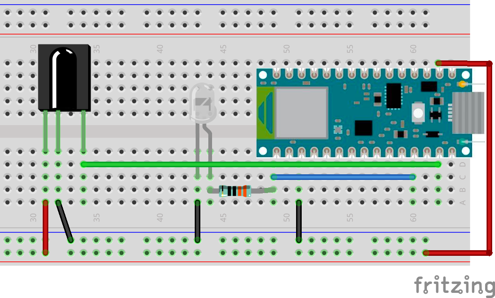
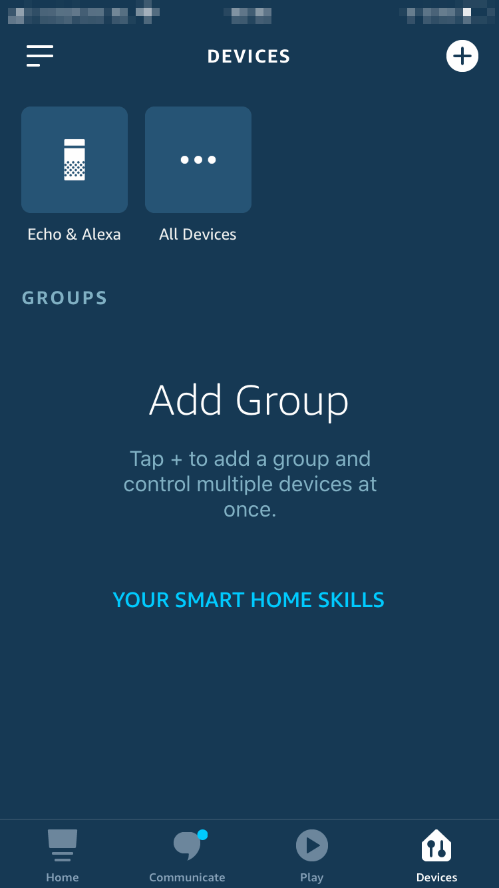
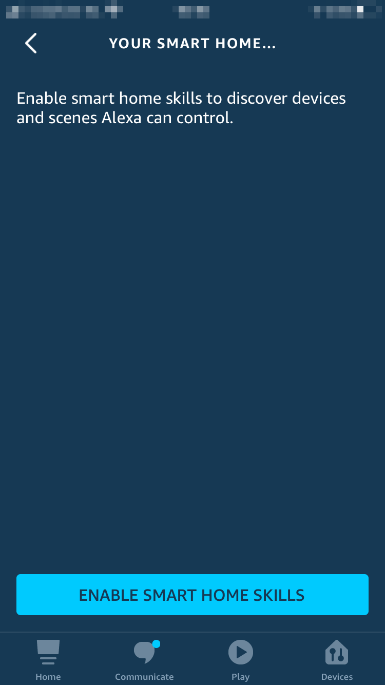
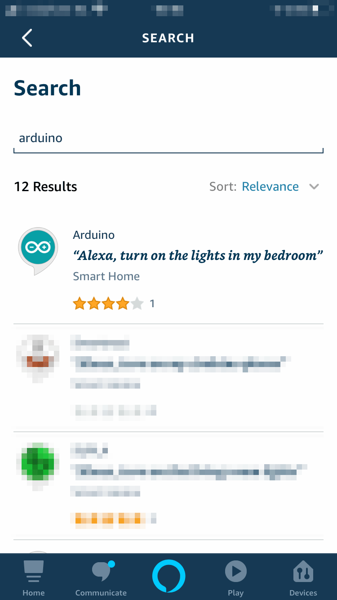
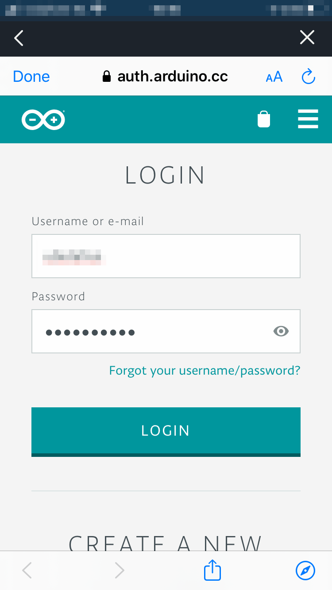
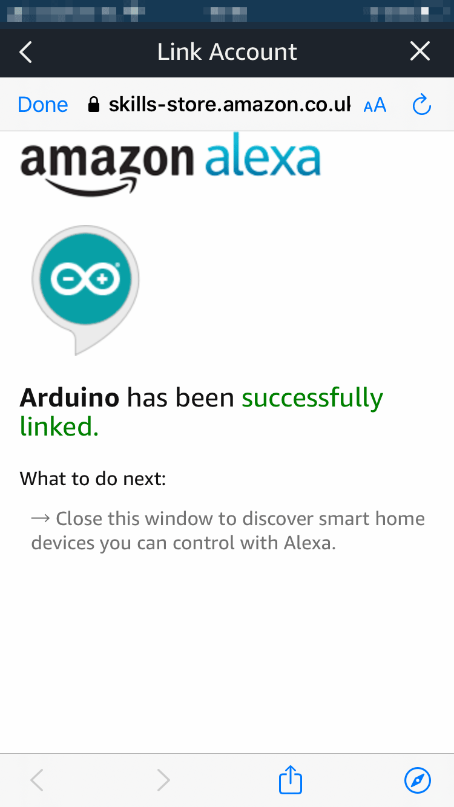
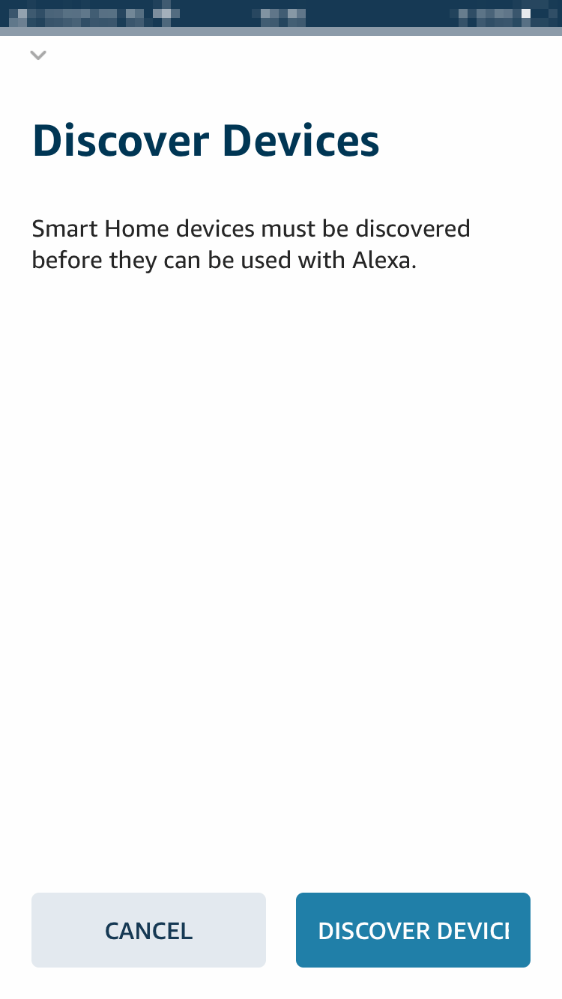
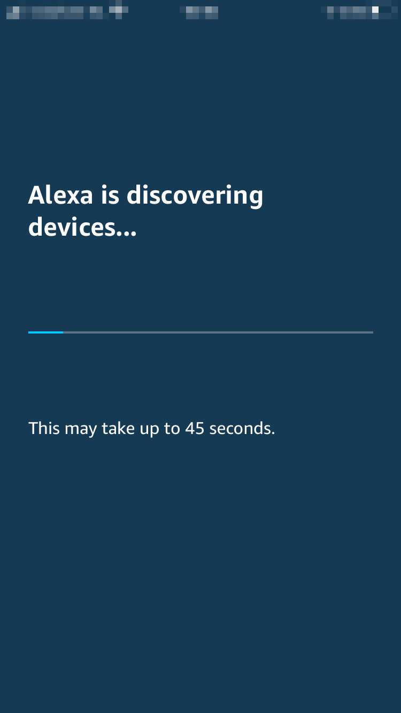
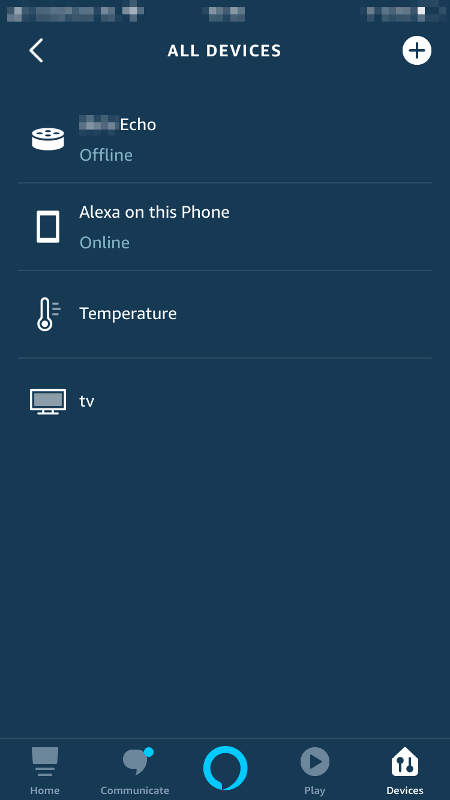

## Components and Supplies

- [Arduino Nano 33 IoT](https://store.arduino.cc/usa/nano-33-iot)
- [Resistor 330 ohm](https://www.newark.com/multicomp/mccfr0w4j0331a50/carbon-film-resistor-330-ohm-250mw/dp/58K5042?COM=ref_hackster)
- [IR receiver (generic)](https://www.newark.com/02P9885?COM=ref_hackster)
- IR transmitter (generic)
- [Jumper wires (generic)](https://www.newark.com/88W2571?COM=ref_hackster)
- [Breadboard (generic)](https://www.newark.com/99W1759?COM=ref_hackster)

## Apps and Online Services

- [Arduino Web Editor](https://create.arduino.cc/editor)
- [Arduino IoT Cloud](https://cloud.arduino.cc)
- [Arduino Amazon Alexa Official Arduino Skill](https://www.amazon.com/Arduino-LLC/dp/B07ZT2PK2H)

## About This Project

### Intro: Arduino IoT Cloud

[Arduino IoT Cloud](https://create.arduino.cc/iot/) is a platform that enables anyone to build IoT connected object with ease. In order to control our TV using Alexa, we'll also be using the [Official Arduino Alexa Skill](https://www.amazon.com/Arduino-LLC/dp/B07ZT2PK2H).

If you are new to Arduino IoT Cloud, we advise to first take a look at [this introductory project](https://create.arduino.cc/projecthub/133030/iot-cloud-getting-started-c93255), which will give you an overview and guide you through the process of setting up one of the supported boards, IoT Cloud *Things* and *Properties* and get you onboard.

### Part 1: How to Control a TV Set

The easiest way to control any kind of television, is to act as if we were its very own remote infrared controller. In order to do so, we'll have to *listen* for the signals the remote will send, capture the data and mimic it with our Arduino board. Once the circuit is assembled, we'll upload [this sketch](https://create.arduino.cc/example/library/irremote_2_2_3/irremote_2_2_3%5Cexamples%5CIRrecvDumpV2/IRrecvDumpV2/preview) to our board. It will translate the IR signal bursts generated by remote button presses into an array of unsigned integers. Let's point the remote at the Arduino **IR Receiver** we built and press the following buttons:

* POWER/STANDBY
* CHANNELS FROM 1 TO 9
* VOLUME UP
* VOLUME DOWN
* MUTE
* CHANNEL UP
* CHANNEL DOWN

We'll see the values coming through the *Serial Monitor*, reported as `rawData`. Let's take note of them into a text file for now, and assign each list its own array name (`chan1`, `chan2` and so on). The following values are just for reference, and are generated by a Samsung's TV remote.

```arduino
CHANNEL 1
unsigned int chan1[67] = {4450,4500, 550,1700, 500,1700, 550,1700, 550,550, 550,600, 500,600, 550,550, 550,600, 500,1700, 550,1700, 550,1700, 500,600, 500,600, 550,550, 550,600, 500,600, 550,550, 550,600, 500,1700, 550,600, 500,600, 550,550, 550,600, 500,600, 550,1700, 500,1700, 550,600, 500,1700, 550,1700, 550,1700, 500,1700, 550,1700, 500};
CHANNEL 2
unsigned int chan2[67] = {4500,4500, 550,1700, 500,1700, 550,1700, 550,550, 550,550, 550,600, 500,600, 550,600, 500,1700, 550,1700, 500,1700, 550,600, 500,600, 550,550, 550,600, 500,600, 550,1700, 500,600, 550,1700, 500,600, 550,550, 550,600, 500,600, 550,550, 550,650, 450,1700, 550,600, 500,1700, 550,1700, 500,1700, 550,1700, 550,1700, 500};
CHANNEL 3
unsigned int chan3[67] = {4500,4500, 500,1700, 550,1700, 550,1700, 500,600, 550,550, 550,600, 500,600, 550,550, 550,1700, 500,1700, 550,1700, 550,550, 550,600, 500,600, 550,550, 550,600, 500,600, 550,1700, 500,1700, 550,600, 550,550, 550,550, 550,600, 550,550, 550,1700, 500,600, 550,550, 550,1700, 550,1650, 550,1700, 550,1700, 500,1700, 600};
CHANNEL 4
unsigned int chan4[67] = {4450,4450, 550,1700, 550,1700, 500,1700, 550,600, 500,600, 550,550, 600,550, 500,600, 550,1700, 500,1700, 550,1700, 550,550, 550,600, 500,600, 550,550, 550,600, 500,600, 550,550, 550,600, 500,1700, 550,600, 500,600, 550,550, 550,600, 500,1700, 550,1700, 550,1700, 500,600, 550,1700, 500,1700, 550,1700, 550,1700, 500}; 
CHANNEL 5
unsigned int chan5[67] = {4500,4500, 500,1700, 550,1700, 550,1700, 550,550, 550,550, 550,550, 600,550, 550,550, 550,1700, 550,1650, 550,1700, 550,550, 550,600, 500,600, 550,550, 550,600, 500,1700, 550,600, 500,600, 550,1700, 500,600, 550,550, 550,600, 550,550, 550,550, 550,1700, 550,1700, 500,600, 550,1700, 500,1700, 550,1700, 550,1700, 500}; 
CHANNEL 6
unsigned int chan6[67] = {4500,4500, 550,1650, 550,1700, 550,1700, 500,600, 550,550, 550,600, 500,600, 500,600, 550,1700, 500,1700, 550,1700, 550,550, 600,550, 500,600, 550,550, 600,550, 550,550, 550,1700, 500,600, 550,1700, 500,600, 550,550, 550,600, 500,600, 550,1700, 500,600, 550,1700, 500,600, 550,1650, 600,1650, 550,1700, 550,1650, 600}; 
CHANNEL 7
unsigned int chan7[67] = {4500,4500, 550,1700, 500,1700, 550,1750, 500,550, 550,600, 500,650, 500,550, 550,550, 550,1750, 500,1700, 500,1700, 550,650, 450,650, 500,550, 550,600, 500,650, 500,550, 550,600, 500,1700, 550,1750, 500,600, 500,550, 550,600, 500,650, 500,1750, 450,1700, 550,600, 500,650, 500,1700, 500,1700, 550,1750, 500,1700, 500}; 
CHANNEL 8
unsigned int chan8[67] = {4450,4550, 500,1700, 550,1700, 550,1650, 550,600, 500,600, 550,550, 550,600, 500,600, 550,1700, 500,1700, 550,1700, 550,550, 550,600, 500,600, 550,550, 550,600, 500,1700, 550,600, 500,1700, 550,1700, 500,600, 550,550, 550,650, 450,600, 550,550, 550,1700, 550,550, 550,600, 500,1700, 550,1700, 550,1700, 500,1700, 550}; 
CHANNEL 9
unsigned int chan9[67] = {4450,4500, 550,1700, 550,1700, 500,1700, 550,600, 500,600, 550,550, 550,600, 500,600, 550,1700, 500,1700, 550,1700, 500,600, 550,550, 550,600, 500,600, 550,550, 550,600, 500,1700, 550,1700, 550,1700, 500,600, 550,550, 550,550, 550,600, 500,1700, 550,600, 500,600, 550,550, 550,1700, 550,1700, 500,1700, 550,1700, 550}; 
VOLUME UP
unsigned int volUp[67] = {4500,4500, 550,1700, 500,1750, 500,1700, 550,600, 500,600, 500,600, 550,550, 550,600, 500,1700, 550,1700, 550,1700, 500,650, 450,600, 550,600, 500,650, 450,650, 500,1700, 500,1750, 500,1750, 500,550, 550,600, 500,650, 500,550, 550,600, 500,650, 500,600, 500,600, 500,1700, 550,1750, 450,1750, 500,1700, 550,1700, 500}; 
VOLUME DOWN
unsigned int volDown[67] = {4450,4550, 500,1700, 550,1700, 550,1650, 550,600, 550,550, 550,600, 500,600, 500,600, 550,1700, 500,1700, 550,1700, 550,550, 550,600, 500,600, 550,550, 550,600, 500,1700, 550,1700, 550,600, 500,1700, 550,600, 500,600, 500,600, 550,550, 550,600, 500,650, 500,1700, 500,650, 500,1700, 500,1750, 500,1700, 550,1700, 500}; 
CHANNEL UP
unsigned int chanUp[67] = {4500,4450, 550,1700, 550,1650, 550,1700, 550,550, 550,600, 550,550, 550,550, 600,550, 550,1650, 550,1700, 550,1650, 600,550, 550,550, 550,600, 500,600, 550,550, 550,550, 550,1700, 550,550, 600,550, 550,1650, 550,600, 550,550, 550,550, 550,1700, 550,550, 550,1700, 550,1700, 550,550, 550,1650, 600,1650, 550,1700, 550}; 
CHANNEL DOWN
unsigned int chanDown[67] = {4500,4450, 600,1650, 550,1700, 550,1650, 550,600, 550,550, 550,550, 550,600, 500,600, 550,1700, 500,1700, 550,1700, 550,550, 550,600, 550,550, 550,550, 550,550, 600,550, 550,550, 550,600, 500,600, 550,1650, 600,550, 550,550, 550,550, 600,1650, 550,1700, 500,1700, 600,1650, 550,550, 600,1650, 550,1700, 500,1700, 550};
```

### Part 2: Arduino IoT Cloud

From the main **Arduino IoT Cloud** page, we'll create a new *Thing* and assign it a meaningful name. Let's call it **TVRemoteController**. We'll then select the board we are going to use. For this tutorial we used an Arduino Nano 33 IoT, but if you have another compatible board it will also be fine, just keep in mind that the pinout and the behavior of the IR library might change. If at this point you cannot see your board, you might have skipped the *Getting Started* procedure we mentioned above, if this is the case, go back through that process.

Once done, we'll add one *Property* to our *Thing*, it will represent our TV set. Under the *Smart Home* category, select "TV" as Property Type, set it as "Read & Write", and under "Update" select "When the value changes".

Here it is what the *Properties* view of our Thing should look like at this point:


### Part 3: Arduino Web Editor

The time has come to click on the "EDIT SKETCH" button, which will take us the Web Editor, where we can add some custom code to the Sketch automatically generated by IoT Cloud.

The first thing we have to include is the [IR Remote](https://github.com/z3t0/Arduino-IRremote) library, by Ken Shirriff.

```arduino
#include <IRremote.h>
```

We then have to setup one two-dimensional array for our channels, and 6 arrays for the commands we need. If you remember, in Part 1 we captured some IR data which we'll now use to fill our arrays

```arduino
const unsigned int chan[9][67] = {
 {chan1},
 {chan2},
 {chan3},
 {chan4},
 {chan5},
 {chan6},
 {chan7},
 {chan8},
 {chan9}
};
const unsigned int volUp[67] = {...}; 
const unsigned int volDown[67] = {...};
const unsigned int chanUp[67] = {...}; 
const unsigned int chanDown[67] = {...};
const unsigned int onoff[67] = {...};
const unsigned int mute[67] = {...};
```

Let's then setup the IR library and the required frequency (for this kind of application it will always be 38KHz)

```arduino
IRsend irsend;
const int freq = 38;
```

We'll also need a function to send out IR commands and blink the built-in LED (at this stage mostly for debugging purposes). The delay value used will depend on the make and model of your television, so feel free to tweak it if things aren't working as expected (wrong commands or no commands received).

```arduino
void sendIR(const unsigned int buf[]) {
 digitalWrite(LED_BUILTIN, HIGH);
 irsend.sendRaw(buf, 67, freq);
 delay(300);
 digitalWrite(LED_BUILTIN, LOW);
}
```

The final step is to complete the generated callback `onTvChange()` with some custom code in order to send IR commands when the TV property is changed by Alexa commands. For example, if the volume is increased, we have to virtually press the button *Volume Up,* if the channel is set to 7, we have to send the sequence for the channel 7 button, and so on.

```arduino
void onTvChange() {
 Serial.println("==================");
 Serial.println("Switch:"+String(tv.getSwitch()));
 Serial.println("Volume:"+String(tv.getVolume()));
 Serial.println("Channel:"+String(tv.getChannel()));
 Serial.println("Mute:"+String(tv.getMute()));
 Serial.println("==================");
 if (first){
 prevSwitch = tv.getSwitch();
 prevVolume = tv.getVolume();
 prevChannel = tv.getChannel();
 prevMute = tv.getMute();
 first = false;
 return;
 } 
 // Volume changed
 if (tv.getVolume() > prevVolume) {
 tv.setMute(false);
 prevMute = false;
 for (int k = prevVolume + 1 ; k<=tv.getVolume(); k++) {
 sendIR(volUp);
 Serial.println("Volume requested:"+String(tv.getVolume())+" Set:"+String(k)); 
 }
 prevVolume = tv.getVolume();
 }
 else if (tv.getVolume() < prevVolume) {
 tv.setMute(false);
 prevMute = false;
 for (int k = prevVolume - 1; k>=tv.getVolume(); k--) {
 sendIR(volDown);
 Serial.println("Volume changed:"+String(tv.getVolume())+" Set:"+String(k)); 
 }
 prevVolume = tv.getVolume();
 }
 // Mute changed
 if (tv.getMute() != prevMute && tv.getMute()) {
 prevMute = tv.getMute();
 sendIR(mute);
 Serial.println("Mute changed:"+String(tv.getMute()));
 }
 else if (tv.getMute() != prevMute && !tv.getMute()) {
 prevMute = tv.getMute();
 sendIR(mute);
 Serial.println("Mute changed:"+String(tv.getMute()));
 }
 // Channel changed
 if (tv.getChannel() != prevChannel) {
 int newChannel = tv.getChannel();
 if (newChannel > 0 && newChannel < 10) {
 sendIR(chan[newChannel-1]);
 } else if (newChannel > 9) {
 if (newChannel > prevChannel) {
 for (int ch = prevChannel; ch < newChannel; ch++) {
 sendIR(chanUp);
 Serial.println("Chan requested:"+String(newChannel)+" Set:"+String(ch)); 
 } 
 } else if (newChannel < prevChannel) {
 for (int ch = prevChannel; ch > newChannel; ch--) {
 sendIR(chanDown);
 Serial.println("Chan requested:"+String(newChannel)+" Set:"+String(ch)); 
 }
 }
 }
 prevChannel = newChannel;
 Serial.println("Channel changed:"+String(tv.getChannel()));
 }
 // On/Off changed
 if (tv.getSwitch() != prevSwitch) {
 prevSwitch = tv.getSwitch();
 if (tv.getSwitch()) {
 sendIR(chan[6]);
 } else {
 sendIR(onoff);
 }
 Serial.println("Switch changed:"+String(tv.getSwitch()));
 }
```

## Complete Sketch

<iframe src='https://create.arduino.cc/editor/Arduino_Genuino/5a7729ba-5158-4ed1-aa65-7a54278d7817/preview?embed&snippet' style='height:510px;width:100%;margin:10px 0' frameborder='0'></iframe>

## Schematics




### Part 4: Amazon Alexa

We will now need the **Amazon Alexa app** which can be downloaded from the [Apple App Store](https://apps.apple.com/us/app/amazon-alexa/id944011620) or the [Google Play Store](https://play.google.com/store/apps/details?id=com.amazon.dee.app). Once installed, login with your existing account or create a new one.

Let's go through the steps necessary to install the Arduino Alexa Skill and configure it to access and control our TV. We'll follow the sequence of images below to see all the required steps.

























## Conlusion

We're done, it's now time to voice control our TV asking things like:

* ”Alexa, turn the volume up on TV.”
* ”Alexa, mute TV" or “Alexa, unmute TV.”
* ”Alexa, next channel on TV.”

Have fun playing with Alexa and IoT Cloud.

Thank you, 

The Arduino Team.