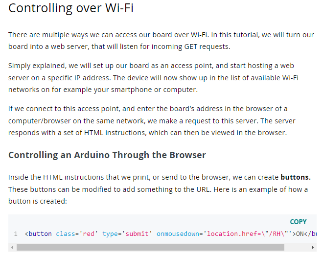
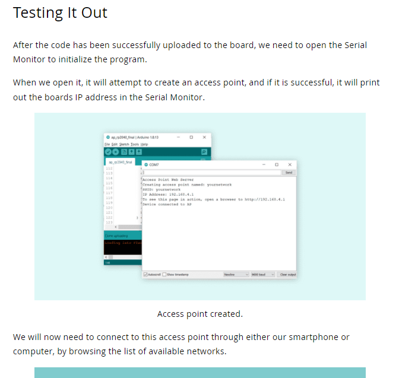
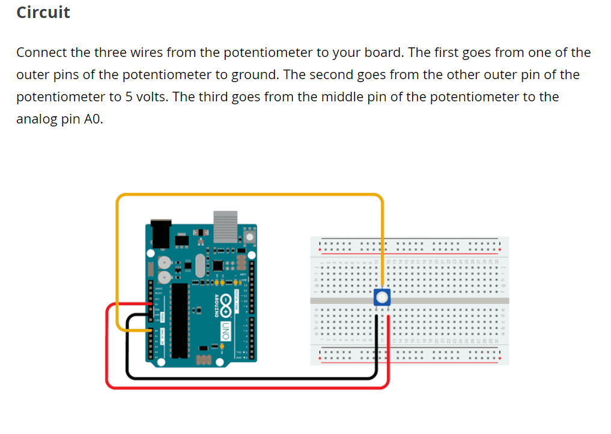
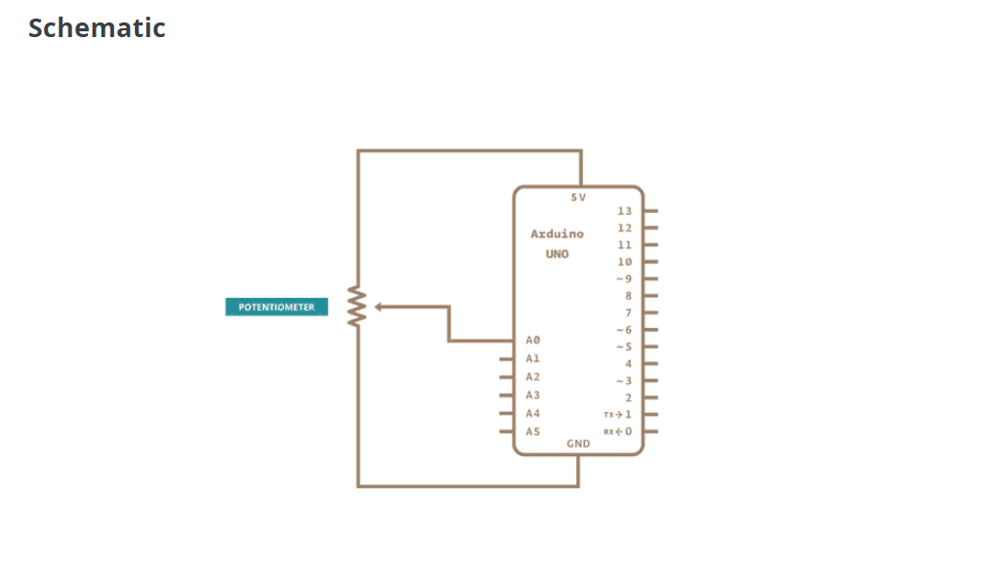
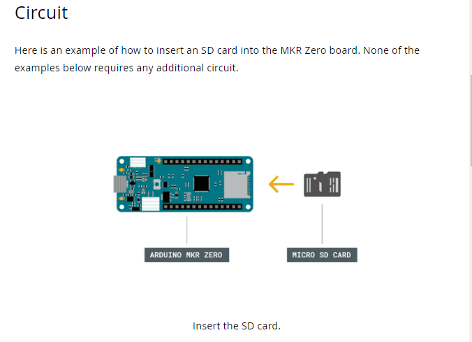
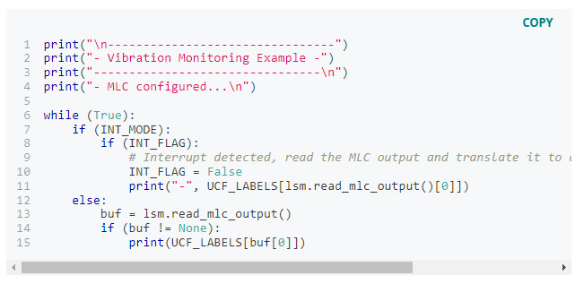
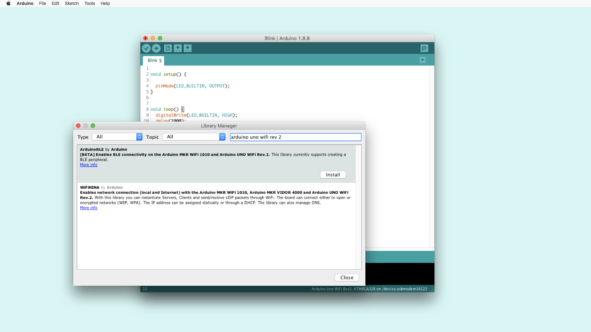

# Contribution to the Arduino Documentation website

We're happy that you have found our contribution page! Here you will find everything you need to know about what you can contribute with to the Arduino Documentation website.

***Please let us know if there is anything missing from or confusing about the contribution instructions and we'll do our best to update them.***

## Steps for Contribution

1. Read this README file before going further in this list.
2. Copy the chosen template folder into the path structure of choice. See below for suggestions on where to place your content.
2. Read the README documentation on how to fill in the template. These are placed inside the corresponding template folder.
3. Read the [Arduino Style Guide](https://docs.arduino.cc/hacking/software/ArduinoStyleGuide) on how to write content.
4. Fill in your template.
   * remove following from your copy when you are done:
     * README.md
     * all assets in assets folder not relating to your content
     * all comments
5. Send in your content for review.
6. Iterate according to feedback.
7. Wait for approval.

---

# What can I contribute with?

## Bugs & Minor fixes

The main thing you can contribute with on the Arduino Documentation repository, is the fixing of bugs, misspelling and other similar but small issues.

***You are allowed to suggest these changes on all content available in this repository.***

## Adding your own content

You are also allowed to add your own content to the Arduino Documentation repository. You are more than welcome to contribute with the following:

|Content|Description|Example|Placement|Example Path|
|-------|-----------|-------|---------|-----|
|[Tutorial](/contribution-templates/tutorial-template)|Learn how to do something.|[Control Built-in RGB LED over Wi-Fi with Nano RP2040 Connect](https://docs.arduino.cc/tutorials/nano-rp2040-connect/rp2040-web-server-rgb)|`Tutorials` folder <br> `Tutorial` folder inside the corresponding product|*content > tutorials* <br><br> *content > hardware > 03.nano > boards > nano-33-ble > tutorials* |
|[Article](/contribution-templates/article-template)|Learn about a specific topic.|[Multimeter Basics](https://docs.arduino.cc/learn/electronics/multimeter-basics)|`Learn`|*content > learn > 04.electronics*|
|[How To](/contribution-templates/how-to-template)|Smaller tutorial with less information and more straight to the example.|[Analog Read Serial](https://docs.arduino.cc/built-in-examples/basics/AnalogReadSerial)|`Tutorials` folder <br> `Tutorial` folder inside the corresponding product <br> `Learn`|*content > tutorials* <br><br> *content > hardware > 03.nano > boards > nano-33-ble > tutorials* <br><br> *content > learn > 04.electronics* |
|Project|Learn how to build something.|[DIY Photoshop Editing Console using Arduino Nano RP2040 Connect](https://create.arduino.cc/projecthub/jithinsanal1610/diy-photoshop-editing-console-using-arduino-nano-rp-2040-a43e97?ref=search&ref_id=nano%20rp2040%20connect&offset=0)|`Project Hub`*|---|

\*Note that the contributed Projects should be added to **Project Hub** instead of on the Arduino Documentation website.

For us to be able to approve your contribution, you should follow the guidelines on how to structure and write your content.

### Writing Content

Please read the [Arduino Style Guide](https://docs.arduino.cc/hacking/software/ArduinoStyleGuide).

---

# Documentation Style Guidelines

## Format Guidelines

### Tutorial Guidelines

To write a tutorial for the Arduino Documentation website, you should follow these guidelines:

|Section|Rules|Description|Example|
|-------|-----|-----------|-------|
|**Frontmatter**|You must fill in title, description and author. The others are voluntary.|Here is where you add the metadata of your tutorial. This is including the author, title of tutorial, compatible libraries, compatible hardware etc.||
|**Introduction**|This is an h2 heading. <br><br> You should not change the name of the heading.|The Introduction to the tutorial should be a maximum of three sentences long and be well descriptive of what the reader can expect of the tutorial.||
|**Goals**|This is an h2 heading. <br><br> You should not change the name of the heading.|What are the goals of this tutorial? What should the reader be able to do at the end?||
|**Hardware & Software Needed**|This is an h2 heading. <br><br> You should not change the name of the heading.|Here you set the hardware and software you need to continue your tutorial. You are more than welcome to link the Arduino based software and hardware to the respective store or downloads page.||
|**Circuit/Schematic**|This is an h2 heading. <br><br> You should not change the name of the heading.|Here you add the circuits and/or schematics of your tutorial.||
|**Focus Feature**|This is an h2 heading. <br><br> Here you are allowed to use as many h3 headings as you want, to be able to divide your content into easier to read sections. <br><br> You can add up to three Focus Feature headings in your tutorial. <br><br> This is the only heading you are allowed to modify.|This sections heading should be updated to the main focus of your tutorial. This is where the information about the focus start.||
|**Programming the Board**|This is an h2 heading. <br><br> You should not change the name of the heading.|This is the section where you go through the code of your tutorial. ||
|**Testing it Out**|This is an h2 heading. <br><br> You should not change the name of the heading.|This is the experimental part of your tutorial, where the reader is supposed to test out the code and focus of your tutorial.||
|**Troubleshoot**|This is an h3 heading. <br><br> You should not change the name of the heading.|If there are something in your tutorial that you know people might get stuck on, or get wrong, this is the section where you give suggestion on how the reader can troubleshoot.||
|**Conclusion**|This is an h2 heading. <br><br> You should not change the name of the heading.|This is where you summarize your tutorial in a few sentences. What is it that you hoped to have taught or shown the reader?||

### How To Guidelines

To write a How To for the Arduino Documentation website, you should follow these guidelines:

|Section|Rules|Description|Example|
|-------|-----|-----------|-------|
|**Frontmatter**|You must fill in title, description and author. The others are voluntary.|Here is where you add the metadata of your How To. This is including the author, title of How To, compatible libraries, compatible hardware etc. <br><br> You must fill in title, description and author. The others are voluntary. **Note** that you must remove the sections in the frontmatter which are empty.||
|**Introduction**|This is an h2 heading. <br><br> You should not change the name of the heading.|The Introduction to the tutorial should be a maximum of three sentences long and be well descriptive of what the reader can expect of the How To.||
|**Hardware & Software Needed**|This is an h2 heading. <br><br> You should not change the name of the heading.|Here you set the hardware and software you need to continue your How To. You are more than welcome to link the Arduino based software and hardware to the respective store or downloads page.||
|**Circuit**|This is an h2 heading. <br><br> You should not change the name of the heading.|Here you add the circuit/s and of your How To.||
|**Schematic**|This is an h2 heading. <br><br> You should not change the name of the heading.|Here you add the schematic/s and of your How To.||
|**Code**|This is an h2 heading. <br><br> You should not change the name of the heading.|This is where you add your sketch code as well as the descriptive text explaining what the code does and is used for.||
|**Learn more**|This is an h2 heading. <br><br> You should not change the name of the heading.|This is where you link to more information that the reader could be interested in. This could for example be other tutorials that delve deeper into the same topic, or a project that focus on the learnings of this How To.||

### Article Guidelines

To write a article for the Arduino Documentation website, you should follow these guidelines:

|Section|Rules|Description|Example|
|-------|-----|-----------|-------|
|**Frontmatter**|You must fill in title, description and author. The others are voluntary.|Here is where you add the metadata of your article. This is including the author, title of tutorial, compatible libraries, compatible hardware etc.||
|**Introduction**|This is an h2 heading. <br><br> You should not change the name of the heading.|The Introduction should be a maximum of three sentences long and be well descriptive of what the reader can expect of the article.||
|**Hardware & Software Needed**|This is an h2 heading. <br><br> You can modify the heading if your article only requires one of the two, either Hardware or Software.|Here you set the hardware and software you need to continue your tutorial. You are more than welcome to link the Arduino based software and hardware to the respective store or downloads page.||
|**Circuit/Schematic**|This is an h2 heading. <br><br> You should not change the name of the heading.|Here you add the circuits and/or schematics of your tutorial.| <br><br> |

## Markdown

We write all of our content in markdown. To be able to contribute properly to our website, we suggest you to do the same. Practice your markdown skills here: https://commonmark.org/help/tutorial/ 

You should use the following markdown styling for our content:

|Style|Use|Description|Example|
|-----|---|-----------|-------|
|**Bold**|\*\*bold**|Use bold when you are referring to either a path in the chosen software, or when you want to highlight a specific topic or button.||
|**Inline Code**|\`code\`|Use the inline code markdown for code inside text sections.||
|**Code Snippet**|\```arduino <br><br> this is my code <br><br>\```|Use the code snippet markdown for longer code snippets.||
|**Notes**|\*\*\*Note: This is my note.***|Use the three asterisks for note tags. Note that these can’t contain line-breaks unless made with a \<br> tag.||
|**Quotes**|\> This is a quote.|Use sparsely and with quotes only.||
|**Bullet points**|\* bullet point 1 <br>\* bullet point 2 <br>\* bullet point 3|Use the * or the - to make bullet points in your tutorial. <br><br> If your bullet point is a full sentence, remember to punctuate it. If your bullet point is a single word, or words not making a sentence, leave the punctuation off.||
|**Numbered lists**|\*\*1.** One <br>\*\*2.** Two <br>\*\*3.** Three|Make sure to bold your numbering lists to make them format properly.||
|**Paths**|This > is > my > path|Use > when describing paths in your chosen software.||
|**Images**||Use the image tag to display images.||

***Note that we are not including cursive writing as a markdown style. We implore you not to use cursive as a means to highlight text. Instead use bold.***

<!--

## Graphics

All graphics should be **1920x1080**. All graphics are stored in an assets folder in the documentation folder. See section **Naming Guidelines**.

|Type|Purpose|Guidelines|Example|
|----|-------|----------|-------|
|Circuit/Schematic|**Circuit diagrams** represent how Arduino products work with components in order to function. <br> A **schematic** is a stylized electronic diagram explaining electric circuits.|Please follow [this]() guide on how to create your own Arduino approved circuit diagrams and schematics.|<br>|
|Screenshot|**Screenshots** are most often used to show the program in the Arduino IDE or any other chosen software.|Please follow [this]() guide on how to create your own Arduino approved screenshots.|<br><br>| 

-->

## Naming Guidelines

### Files

Name the folder after the title of your documentation. The name of the folder should contain a maximum of 4 words divided by dashes.

`connector-basics`

`SoftwareSerialExample`


The folder should then contain an assets folder, as well as the main content markdown file. It’s important to name the main content file the same name as the folder.

`connector-basics.md`

`SoftwareSerialExample.md`


### Images

There is no specific way you need to name the images, however it is a good practice to add something descriptive in the name. Also remember to divide words by using dashes.

`UNO-Mini-LE-external-power.png`

`rp2040-ap-mode-img-01.png`
