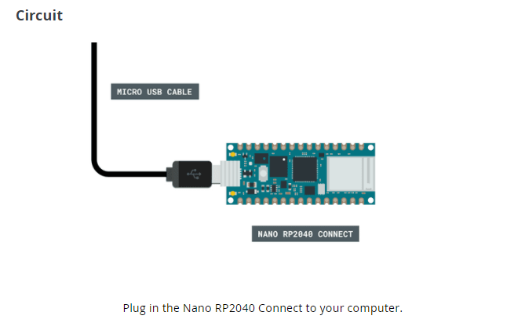
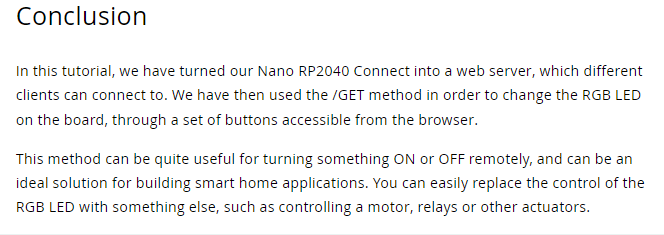

To write a tutorial for the Arduino Documentation website, you should follow these guidelines:

# Structure

|Section|Rules|Description|Example|
|-------|-----|-----------|-------|
|**Frontmatter**|You must fill in title, description and author. The others are voluntary.|Here is where you add the metadata of your tutorial. This is including the author, title of tutorial, compatible libraries, compatible hardware etc.||
|**Introduction**|This is an h2 heading.    You should not change the name of the heading.|The Introduction to the tutorial should be a maximum of three sentences long and be well descriptive of what the reader can expect of the tutorial.||
|**Goals**|This is an h2 heading.    You should not change the name of the heading.|What are the goals of this tutorial? What should the reader be able to do at the end?||
|**Hardware & Software Needed**|This is an h2 heading.    You should not change the name of the heading.|Here you set the hardware and software you need to continue your tutorial. You are more than welcome to link the Arduino based software and hardware to the respective store or downloads page.||
|**Circuit/Schematic**|This is an h2 heading.    You should not change the name of the heading.|Here you add the circuits and/or schematics of your tutorial.||
|**Focus Feature**|This is an h2 heading.    Here you are allowed to use as many h3 headings as you want, to be able to divide your content into easier to read sections.    You can add up to three Focus Feature headings in your tutorial.    This is the only heading you are allowed to modify.|This sections heading should be updated to the main focus of your tutorial. This is where the information about the focus start.||
|**Programming the Board**|This is an h2 heading.    You should not change the name of the heading.|This is the section where you go through the code of your tutorial. ||
|**Testing it Out**|This is an h2 heading.    You should not change the name of the heading.|This is the experimental part of your tutorial, where the reader is supposed to test out the code and focus of your tutorial.||
|**Troubleshoot**|This is an h3 heading.    You should not change the name of the heading.|If there are something in your tutorial that you know people might get stuck on, or get wrong, this is the section where you give suggestion on how the reader can troubleshoot.||
|**Conclusion**|This is an h2 heading.    You should not change the name of the heading.|This is where you summarize your tutorial in a few sentences. What is it that you hoped to have taught or shown the reader?||